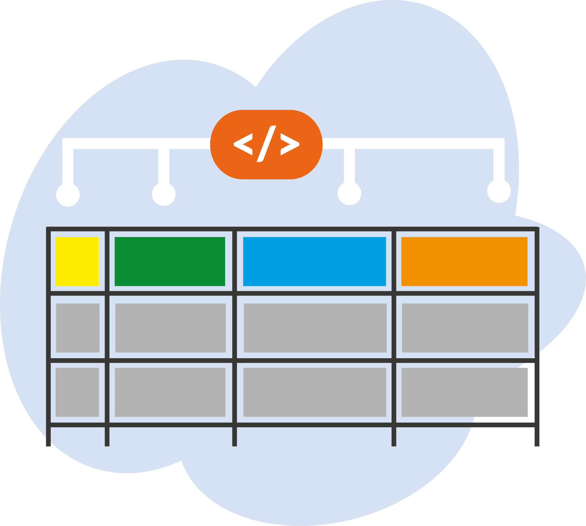

# Livemark

[](https://github.com/frictionlessdata/livemark/actions)
[](https://codecov.io/gh/frictionlessdata/livemark)
[](https://pypi.python.org/pypi/livemark)
[](https://github.com/frictionlessdata/livemark)
[](https://discord.com/channels/695635777199145130/695635777199145133)

Share data insight in Markdown with interactive tables, charts, and more.

## Install

Livemark is a Python library and it can be installed with PIP:

```bash
$ pip install livemark
```

## Usage

Livemark comes with a command-line interface:

```bash
# Build a single document
$ livemark build '<path=index.md>'

# Start a livereload server
$ livemark start
```

When you build/start Livemark it takes your `index.md` (or a provided file) and generates a corresponding HTML file. It extends markdown as it's explained in the sections below.

## Logic

> https://jinja.palletsprojects.com/en/3.0.x/templates/

Livemark preprosecces your document using Jinja templating language:


```markup

- number: {{ number }}

```



- number: {{ number }}


## Table

> https://handsontable.com/docs/9.0.0/tutorial-introduction.html

Livemark supports CSV tables rendering (replace single quotes by back ticks) using Handsontable. The `data` property will be read by [Frictionless Framework](https://framework.frictionlessdata.io/) so in addition to Handsontable options you can pass a file path or a resource descriptor in a Frictionless format:

```yaml
'''table
data: data/cars.csv
maxRows: 10
filters: true
dropdownMenu: true
columnSorting:
  initialConfig:
    column: 2
    sortOrder: desc
width: 600
'''
```

```table
data: data/cars.csv
maxRows: 10
filters: true
dropdownMenu: true
columnSorting:
  initialConfig:
    column: 2
    sortOrder: desc
width: 600
```

## Chart

> https://vega.github.io/vega-lite/

Livemark supports Vega Lite visualisations rendering (replace single quotes by back ticks):

```yaml
'''chart
data:
  url: data/cars.csv
mark: circle
selection:
  brush:
    type: interval
# other options are omitted
width: 500
height: 300
'''
```

```chart
data:
  url: data/cars.csv
mark: circle
selection:
  brush:
    type: interval
encoding:
  x:
    type: quantitative
    field: kmpl
    scale:
     domain: [12,25]
  y:
    type: quantitative
    field: price
    scale:
     domain: [100,900]
  color:
    condition:
      selection: brush
      field: type
      type: nominal
    value: grey
  size:
    type: quantitative
    field: bhp
width: 500
height: 300
```

## Code

> https://prismjs.com/

Syntax highlithing is proviced by PrismJS (replace single quotes by back ticks):

```markup
'''python
# This program adds two numbers

num1 = 1.5
num2 = 6.3

# Add two numbers
sum = num1 + num2

# Display the sum
print('The sum of {0} and {1} is {2}'.format(num1, num2, sum))
'''
```

```python
# This program adds two numbers

num1 = 1.5
num2 = 6.3

# Add two numbers
sum = num1 + num2

# Display the sum
print('The sum of {0} and {1} is {2}'.format(num1, num2, sum))
```

## Style

> https://getbootstrap.com/docs/4.6/getting-started/introduction/

With Livemark you can use HTML inside Markdown with Bootstrap 4 support. Here is an example of creating a responsive grid of cards (note that if we set a `markdown` class we can use markdown inside html):

```html
<div class="w-50">
<div class="container">
<div class="row">
<div class="col-sm">
  <div class="markdown"></div>
  <div class="text-center">
  <p><strong>Data Package</strong></p>
  <p>A simple container format for describing a coherent collection of data in a single package.</p>
  </div>
</div>
<!-- other columns are omitted -->
</div>
</div>
</div>
```

<div style="max-width: 600px">
<div class="container">
<div class="row">
<div class="col-sm">
  <div class="markdown"></div>
  <div class="text-center">
  <p><strong>Data Package</strong></p>
  <p>A simple container format for describing a coherent collection of data in a single package.</p>
  </div>
</div>
<div class="col-sm markdown">
  <div class="markdown"></div>
  <div class="text-center">
  <p><strong>Data Resource</strong></p>
  <p>A simple format to describe and package a single data resource such as a individual table or file.</p>
  </div>
</div>
<div class="col-sm markdown">
  <div class="markdown"></div>
  <div class="text-center">
  <p><strong>Table Schema</strong></p>
  <p>A simple format to declare a schema for tabular data. The schema is designed to be expressible in JSON.</p>
  </div>
</div>
</div>
</div>
</div>

## Content

> https://guides.github.com/features/mastering-markdown/

Livemark support GFM-flavoured Markdown so you can use already familiar notation:


## Sidebar

> https://tscanlin.github.io/tocbot/

Livemark provides a automatically generated table of contents:


## Scroll

> https://azrsix.github.io/ue-scroll-js/

Livemark provides a scroll-to-top button when you scroll down your document:


## Layout

> https://github.com/frictionlessdata/livemark/blob/main/livemark/assets/templates/layout.html

It's possible to customize the layout. You need to save it first:

```bash
$ livemark layout > layout.html
```

Then, you can update the layout as whole or use Jinja's inheritance. For example, let's use Tailwind instead of Bootstrap and some custom styles:

> layout.html


```html
.


<link rel="stylesheet" href="static/tailwind.css">
<link rel="stylesheet" href="static/custom.css">

```


Then link your new layout in markdown documents:

> article.md

```md
---
layout: layout.html
---
# My Article

This article uses a custom layout
```

## Publish

> https://pages.github.com/

Livemark just generates a static HTML document so you can publish it using any static page hosting. Probably the simplest way is to use Github Pages. Just go to "Settings->Pages" in your repository and choose your main branch in the source menu:


